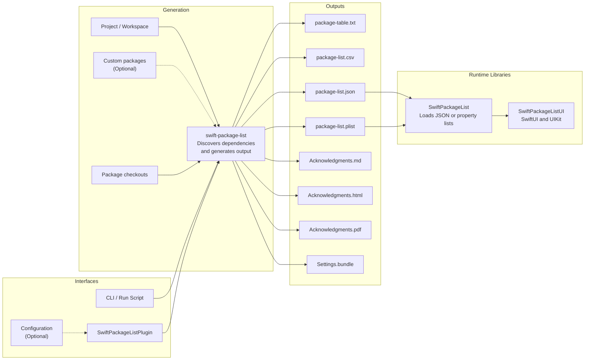

# Architecture

```mermaid
flowchart LR
    subgraph interfaces["Interfaces"]
        direction LR
        cli["CLI / Run Script"]
        plugin["SwiftPackageListPlugin"]
        config["Configuration<br/>(Optional)"]
        config -.-> plugin
    end

    subgraph generation["Generation"]
        direction LR
        project["Project / Workspace"]
        custom["Custom packages<br/>(Optional)"]
        tool["swift-package-list<br/>Discovers dependencies<br/>and generates output"]
        checkouts["Package checkouts"]

        project --> tool
        custom -.-> tool
        checkouts --> tool
    end

    subgraph outputs["Outputs"]
        direction LR
        table["package-table.txt"]
        csv["package-list.csv"]
        json["package-list.json"]
        plist["package-list.plist"]
        markdown["Acknowledgments.md"]
        html["Acknowledgments.html"]
        pdf["Acknowledgments.pdf"]
        settings["Settings.bundle"]
    end

    subgraph runtime["Runtime Libraries"]
        direction TB
        library["SwiftPackageList<br/>Loads JSON or property lists"]
        ui["SwiftPackageListUI<br/>SwiftUI and UIKit"]

        library --> ui
    end

    cli --> tool
    plugin --> tool

    tool --> table
    tool --> csv
    tool --> json
    tool --> plist
    tool --> markdown
    tool --> html
    tool --> pdf
    tool --> settings

    json --> library
    plist --> library
```
